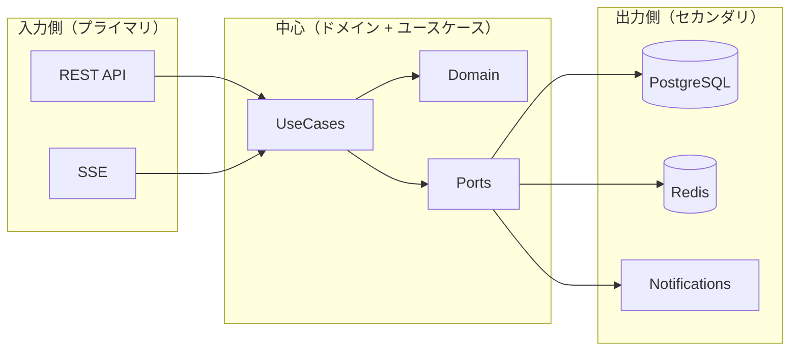

# ヘキサゴナルアーキテクチャを厚めに理解する

> 参考元（概念のベース）  
> ```
> https://alistair.cockburn.us/hexagonal-architecture
> ```

ヘキサゴナルアーキテクチャ（Ports and Adapters）は「中心のルール（ドメイン）を、外部技術から守る」ための設計です。重要なのは **“中心は外部に依存しない”** という一点です。

## なぜ必要か

外部技術（DB/HTTP/メッセージング）は変わりやすい一方、業務ルールは変わりにくい。
ヘキサゴナルは以下を狙います。

- ドメインやユースケースが **DB/HTTP/Redis に引きずられない**
- 外部技術の差し替えが **局所変更** で済む
- テストが **単体でやりやすい**

### よくある失敗と、ヘキサゴナルの狙い

- **失敗例**: DB の都合がドメインモデルに入り込み、ルールの読み取りが難しくなる  
  **狙い**: ドメインを技術から守り、ルールを中心に保つ
- **失敗例**: API がユースケースの手順そのものを持ち、再利用できない  
  **狙い**: ユースケースを「意図の単位」に切り出し、複数入口で共有する

## 中心と周辺

中心: **ドメイン + ユースケース**  
周辺: **アダプター（HTTP、DB、Redis、通知など）**

中心は「やりたいこと（ルール）」、周辺は「どう繋ぐか（技術）」を担当します。

## ポートとアダプターの関係

- **ポート（Port）**: 中心が「外の何か」に期待する抽象インターフェース  
- **アダプター（Adapter）**: 具体技術を使ってポートを実装するもの

ポートは中心側に置き、アダプターは外側に置きます。これが依存性逆転のポイントです。

### ポート設計のコツ

- **ポートは「中心の都合」で定義する**（DB の都合でなく、ユースケースが欲しい操作）
- **アダプターは複数あってよい**（例: PostgreSQL 版 / InMemory 版）

## プライマリ / セカンダリ

- **プライマリアダプター（入力側）**: 外部から中心へ入ってくる
  - 例: REST API, SSE
- **セカンダリアダプター（出力側）**: 中心から外部へ出ていく
  - 例: DB, Redis, 通知（Email/Discord）

### 左右非対称という考え方（変形パターン）

Cockburn の説明では「六角形」はあくまで **複数の入口・出口があり得る** ことを示す比喩です。  
実際には **入力側が 1 つ、出力側が複数** という「左右非対称」な構成がよくあります。

本アプリの例:
- 入力（プライマリ）: REST API / SSE
- 出力（セカンダリ）: DB / Redis / 通知

これが **入口 2、出口 3** の非対称形の典型です。

## このアプリでの具体的対応

### 中心（ドメイン/ユースケース）

- ドメイン: `backend/src/app/domain/**`
  - `Job` 集約、`JobStatus` 状態遷移、ドメインイベント
- ユースケース: `backend/src/app/usecases/**`
  - `CreateJobUseCase`, `CancelJobUseCase` など

### ポート（抽象インターフェース）

- `backend/src/app/ports/repository.py` (JobRepository)
- `backend/src/app/ports/event_publisher.py` (EventPublisher)
- `backend/src/app/ports/notification_sender.py` (NotificationSender)

### プライマリアダプター（入力側）

- REST API: `backend/src/app/adapters/inbound/api/job_router.py`
- SSE: `backend/src/app/adapters/inbound/sse/job_sse.py`

### セカンダリアダプター（出力側）

- DB: `backend/src/app/adapters/outbound/persistence/postgres_job_repository.py`
- Redis Pub/Sub: `backend/src/app/adapters/outbound/messaging/redis_event_publisher.py`
- 通知: `backend/src/app/adapters/outbound/notification/*`

## 図で見る関係（概念）

```
[API/SSE] ---> [UseCases] ---> [Domain]
                 |   ^
                 v   |
            [Ports (抽象)]
                 |   ^
                 v   |
        [Adapters: DB/Redis/Notify]
```

- 左が入力側（プライマリ）
- 右が出力側（セカンダリ）
- 中心はポートにしか依存しない

## Mermaid 図（依存方向の可視化）



## 実装読みのポイント

- **外から中心へ**: API → UseCase → Domain
- **中心から外へ**: Domain events → Publisher → Redis → Worker/SSE

「どこが中心で、どこが外側か」を意識するだけで、コードの見通しが大きく改善します。

## 要点サマリ

- ヘキサゴナルは「中心（ルール）を外部技術から守る」設計
- ポートは中心の都合、アダプターは技術の都合
- 入口/出口は複数あり得る（左右非対称が普通）

## ここまで読んだら

次は DDD 章（`02_ddd.md`）に戻って概念の関係を確認し、  
その後に `04_app_structure.md` で実装への対応を再確認すると理解が定着します。
