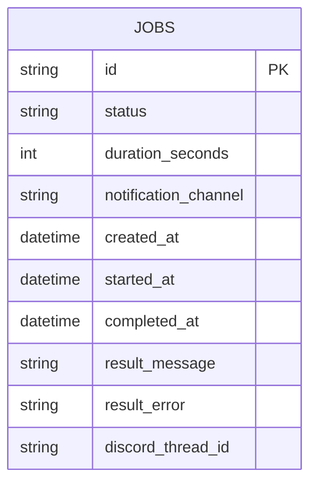

# データモデルと ER 図

このアプリの永続化は `jobs` テーブルのみです。ドメインモデル（Job 集約）を DB 用にフラット化して保存します。

## Mermaid ER 図

## ドメイン ↔ DB の対応

- ドメインの `Job`（集約ルート）は、DB では `jobs` テーブルの 1 行に対応します。
- `JobStatus` / `NotificationChannel` は文字列として保存されます。
- `JobResult` は `result_message` / `result_error` に展開されます。

実装位置:
- ORM モデル: `backend/src/app/adapters/outbound/persistence/models.py`
- 変換ロジック: `backend/src/app/adapters/outbound/persistence/postgres_job_repository.py`

## 重要なポイント

- ドメインモデルは DB に依存しない
- DB の変更はリポジトリで吸収する
- 集約ルートの不変条件は DB ではなくドメインで守る
